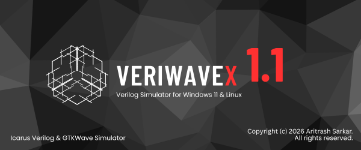

# VeriWaveX - v1.1.0 (Gold Release)
> **The Professional, Cross-Platform Verilog IDE for Engineering Labs.**

[](https://www.rust-lang.org/)
[](LICENSE)
[](https://github.com/your-username/veriwavex/releases)
[](https://github.com/your-username/veriwavex/releases)

---



## Overview
**VeriWaveX** is a high-performance, unified Integrated Development Environment (IDE) built to eliminate environment friction in Computer Architecture and Digital Logic labs. By orchestrating the **Icarus Verilog** engine and **GTKWave** visualizer into a single, hardware-accelerated suite, VeriWaveX provides a "Zero-Config" experience for both Windows and Linux users.

With the **v1.1.0 Gold Release**, VeriWaveX has evolved into a fully cross-platform tool, featuring a portable Linux AppImage designed specifically for locked-down lab environments where `sudo` access is unavailable.

---

## 🚀 Key Features (v1.1.0 Upgrade)

- **Unified Cross-Platform Core**: Re-engineered logic that automatically detects toolchains on Windows and Linux/WSL.
- **Industrial Syntax Highlighting**: A custom-built Verilog lexer featuring the **Gruvbox** theme, specifically tuned for hardware description keywords and system tasks.
- **Smart Project Persistence**: A new "Recent Projects" dashboard backed by JSON persistence for instant workflow resumption.
- **AppImage Portability**: A single-file Linux distribution that runs directly from a USB stick without installation.
- **Commercial UI/UX**: 
    - **Fullscreen Mode**: Launches maximized for a professional IDE feel.
    - **Dynamic Status Bar**: Real-time project metadata and system status tracking.
    - **Auto-Scroll Console**: Intelligent log output that ensures the latest simulation data is always visible.
- **The Wizard Suite**: 
    - **Module Wizard**: Rapidly define pins and boilerplate.
    - **Testbench Wizard**: Automatic generation of `$dumpfile` and `$dumpvars` to prevent empty waveform errors.

---

## 🛠️ Built With

* [Rust](https://www.rust-lang.org/) - Performance-critical systems orchestration.
* [eframe/egui](https://github.com/emilk/egui) - GPU-accelerated Immediate Mode GUI.
* [Icarus Verilog](http://iverilog.icarus.com/) - High-fidelity simulation engine.
* [GTKWave](http://gtkwave.sourceforge.net/) - Industry-standard waveform visualization.

---

## 📥 Getting Started

### Windows Installation
1. Download `VeriWaveX_v1.1.0_Setup.exe` from the [Releases](https://github.com/your-username/veriwavex/releases) page.
2. Run the installer and launch from the Desktop shortcut.
3. **Note**: No external installation of Icarus Verilog is required; it is bundled in the `vendor` directory.

### Linux (Ubuntu/WSL) Usage
1. Download `VeriWaveX-v1.1.0-x86_64.AppImage`.
2. Open your terminal and grant execution permission:
   ```bash
   chmod +x VeriWaveX-v1.1.0-x86_64.AppImage
   ```
3. Launch the app:
    ```bash
    ./VeriWaveX-v1.1.0-x86_64.AppImage
    ```
4. Note: Requires iverilog and gtkwave to be present on the system.

## License & Copyright
### Copyright (c) 2023 Aritrash Sarkar. All Rights Reserved.
VeriWaveX is distributed under a Proprietary License.

- Educational Use: Granted free of charge for students and academic institutions.
- Modification/Redistribution: Unauthorized copying, modification, or redistribution of the source code or binary is strictly prohibited.

Developed with ❤️ by Aritrash Sarkar Innovation Ambassador | CSE Student at MSIT